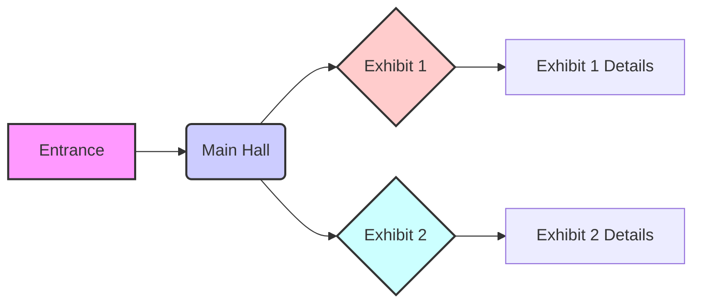

#  Museum floor plan

```mermaid
graph LR
A[Entrance] --> B(Main Hall);
B --> C{Exhibit 1};
B --> D{Exhibit 2};
C --> E[Exhibit 1 Details];
D --> F[Exhibit 2 Details];
style A fill:#f9f,stroke:#333,stroke-width:2px
style B fill:#ccf,stroke:#333,stroke-width:2px
style C fill:#fcc,stroke:#333,stroke-width:2px
style D fill:#cff,stroke:#333,stroke-width:2px
```
