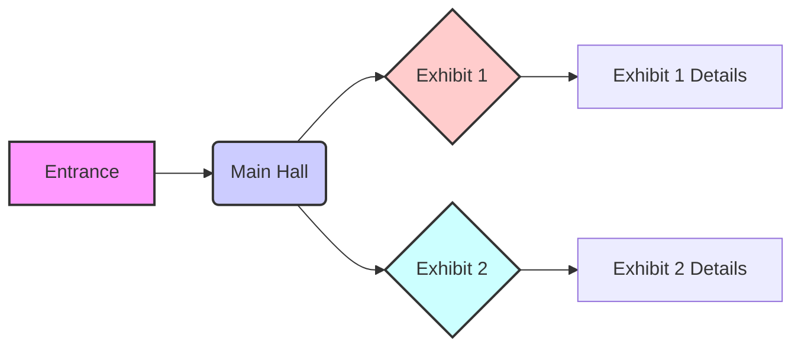

# Things I want to test in Markdown

## Diagrams using Mermaid

## Mathematics

Does LaTeX work as expected?

$$
\Phi(\mathbf{r}) = \frac{1}{4\pi\varepsilon_0} \iiint_{\mathcal{V}} \frac{\rho(\mathbf{r'})}{|\mathbf{r} - \mathbf{r'}|} \, dV'
$$

This equation from electromagnetism calculates the electric potential Φ at position r by integrating over a volume V containing charge density ρ. The denominator represents the distance between the observation point and each charge element, while ε₀ is the permittivity of free space.

Try that with Cartesian coordinates:

$$
\Phi(x,y,z) = \frac{1}{4\pi\varepsilon_0} \int_{x_1}^{x_2} \int_{y_1}^{y_2} \int_{z_1}^{z_2} \frac{\rho(x',y',z')}{\sqrt{(x-x')^2 + (y-y')^2 + (z-z')^2}} \, dx' \, dy' \, dz'
$$
